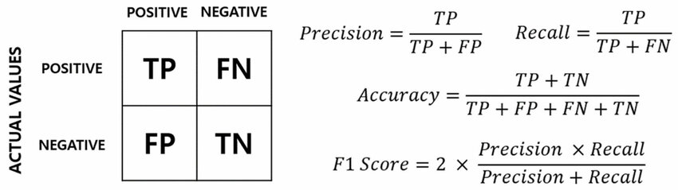
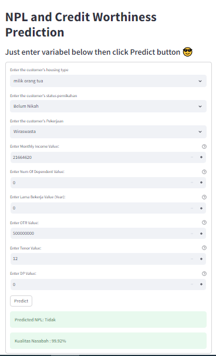

# Deployment Model untuk Prediksi Potensi Nasabah NPL

## Business Problem and Objectives
Dalam dunia keuangan , risiko kredit atau pinjaman yang gagal bayar atau belum melunasi pinjaman lebih dari 90 hari merupakan salah satu ancaman terbesar bagi lembaga keuangan seperti bank atau perusahaan pembiayaan (leasing). Nasabah ini disebut Nasabah Non Performing Loan. Peminjam yang gagal melunasi pinjaman mereka melebihi 90 hari akan mengakibatkan kerugian finansial, tetapi juga dapat mengganggu stabilitas dan kelangsungan hidup institusi keuangan tersebut.

Oleh karena itu kita akan membuat dan melatih model machine learning untu memprediksi apakah suatu nasabah berpotensi menjadi nasabah NPL atau tidak kemudian menilai seberapa berharganya seseorang nasabah berdasarkan probabilitas seseorang menjadi nasabah NPL. Sebagai tambahan kita akan mengemasnya dalam bentuk aplikasi yang user-friendly sehingga user seperti credit analyst dapat menggunakan modelnya tanpa perlu tau seluk-beluk codingnya

## Business Metrics
1. Membuat Model dengan recall tinggi untuk memprediksi nasabah NPL beserta probabilitasnyan.
2. Membuat aplikasi sebagai wadah untuk menggunakan modelnya yang user-friendly untuk user

## Dataset
1. **app_id:** ID aplikasi atau nomor identifikasi unik untuk setiap aplikasi pinjaman.

2. **due_date:** Tanggal jatuh tempo atau batas waktu pembayaran pinjaman.

3. **paid_date:** Tanggal ketika pembayaran berdasarkan `paid_amount` telah diterima oleh pemberi pinjaman.

4. **due_amount:** Sisa jumlah pinjaman uang yang belum dibayar.

5. **paid_amount:** Jumlah uang yang dibayarkan oleh peminjam pada tanggal pembayaran atau `paid_date`.

6. **monthly_income:** Pendapatan bulanan dari peminjam.

7. **housing_type:** Tipe kepemilikan tempat tinggal oleh peminjam .

8. **num_of_dependent:** Jumlah orang tanggungan atau anggota keluarga peminjam yang bergantung pada pendapatannya.

9. **lama_bekerja:** Lama waktu (dalam tahun) peminjam telah bekerja di pekerjaan saat ini.

10. **otr:** atau "On The Road," yaitu harga total mobil termasuk semua biaya yang diperlukan untuk membuat mobil tersebut siap digunakan di jalan raya.

11. **status_pernikahan:** Status pernikahan peminjam.

12. **pekerjaan:** Jenis pekerjaan atau profesi peminjam.

13. **tenor:** Jangka waktu atau durasi pinjaman dalam bulan, menunjukkan berapa lama peminjam akan membayar pinjaman tersebut.

14. **dp:** "Down Payment" adalah jumlah uang muka yang telah dibayarkan oleh peminjam pada saat mengambil pinjaman.

## Machine Learning Workflow


## Machine Learning Metrics
Disini karena user ingin mencari tau sebanyak mungkin calon nasabah yang berpotensi menjadi NPL, maka kita ingin meminimalkan sebanyak mungkin false negatif. Sehingga metric yang utama kita gunakan adalah Recall karena recall digunakan untuk mengukur kemampuan model dalam mengidentifikasi semua sampel positif yang benar. Untuk menentukan bahwa model kita telah berhasil dilatih dan dibuat, kita perlu mendapatkan recall dari model lebih besar dari 90%. Tapi sebagai tambahan akan kita tampilkan juga precision, f1-score dan accuracy. Berikut ini adalah penjelasan mengenai formula metricsnya masing-masing.



Selan itu kita juga akan menggunakan F-1 score karena label datanya mempunyai distribusi yang tidak seimbang, dengan label yang NPL jauh lebih sedikit dibandingkan yang tidak.


## Modelling
Disini kita melatih modelnya dengan algoritma Logistic Regression, Decision Tree, Random Forest, K- Nearest Neighbour, dan XGB. Tiap algoritma itu juga masing-masing kita variasikan dengan hyperparemeter yang menyesuaikan algoritmanya masing-masing. Nantinya hyperparameter terbaik dari setiap model akan ditentukan dengan menggunakan RandomizedSearchCV.
Selain itu setiap model beserta masing-masing hyperparameternya akan dilatih di 3 jenis data berdasarkan metode balancing nya (undersampling, oversampling, SMOTE). Nantinya metode balancing yang terbaik akan diambil berdasarkan accuracy, f1-score, precision, dan recall terbaik. Setelah pelatihan telah selesai dan telah menemukan model terbaik maka modelnya akan disimpan beserta informasi nama modelnya, tanggal pelatihan dan metrik-metriknya .

Dari hasil modelling ini didapatkan model terbaik dan metrics sebagai berikut:
```json
"model_name": "Production-XGBClassifier"
"data_configurations": "Oversampling"
"precision": 1.0,
"recall": 0.9708029197080292,
"f1-score": 0.9851851851851852,
"accuracy": 0.9963436928702011
```

## API and Streamlit Service

### Cara Build Docker API and Streamlit Service ###
Pada local computer:
1. Jalankan `sudo docker compose build` 

### Cara run  API and Streamlit Service ###
Pada local computer:
1. Jalankan `sudo docker compose up` untuk menjalankan API and Streamlit service
2. Kemudian pergi ke `localhost:8501`
   
On online server:
1. Kemudian pergi ke `184.72.120.208:8501`
   
Semua input di Streamlit akan dikirim dan dikembalikan melalui API dalam bentuk format JSON. Selain itu proses deployment ini juga dilakukan secara otomatis sehingga setiap ada perubahan atau push ke repostiory, maka perubahan itu akan otomatis dideploy ker server dengan konsep CI/CD.

### Interface ###
API sebagai back-end Service dan Streamlit sebagai front-end service dibuat menggunakan Docker dan return User interface sebagai berikut:
The API as a back-end service and Streamlit as a front-end service are built using Docker and return an interface as below:



## Kesimpulan and Future Work ##
### Kesimpulan ###
After all those processes, concluded:
1. Model terbaik adalah `XGBClassifier` dengan konfigurasi data terbaik adalah `Oversampling`
2. Nilai Recall dan F-1 score secara berturut-turut adalah 0.971, 0.985
3. Model berhasil dideployment di-local maupun di sercer

### Future Work ###
Hope the next work will:
1. Mengembangkan modelnya dengan algoritma yang lebih advanced atau teknik fitur engineering lain.
2. Membuat UI yang lebih kreatif misalnya menambah foto atau gambar.